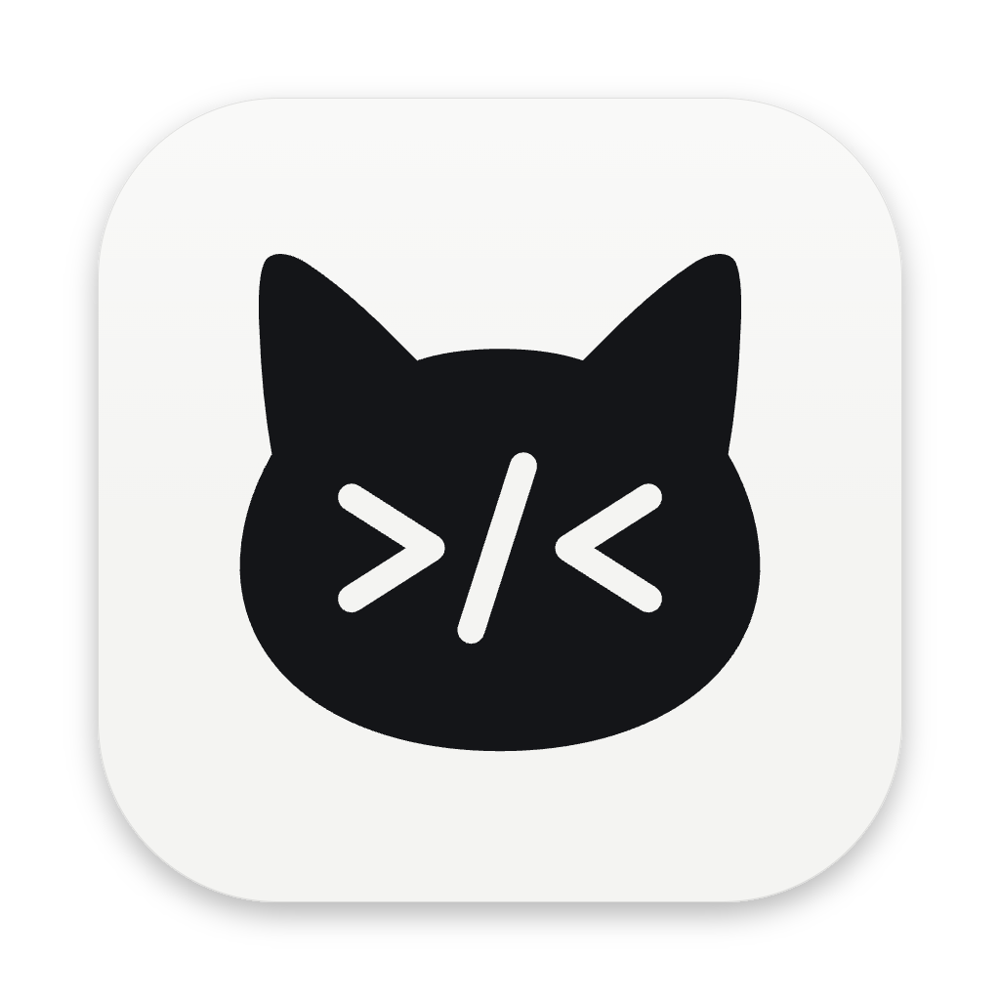
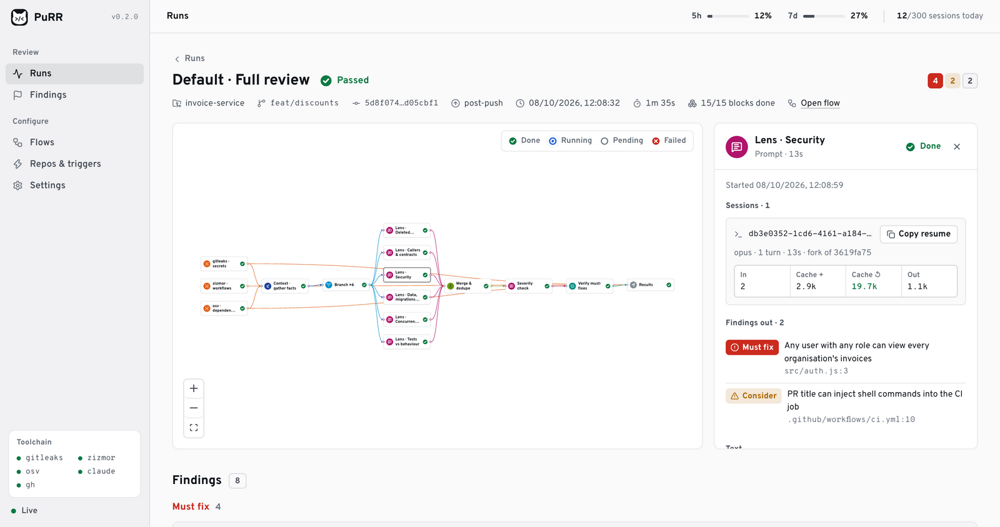
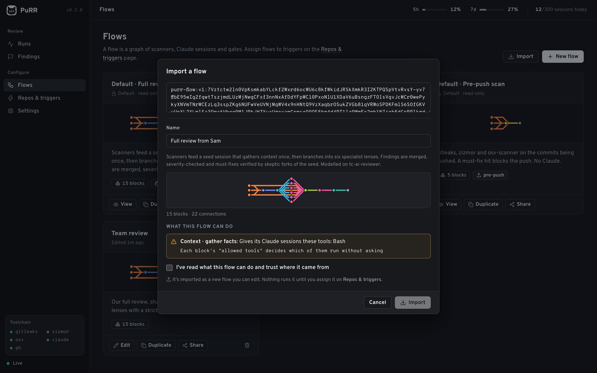
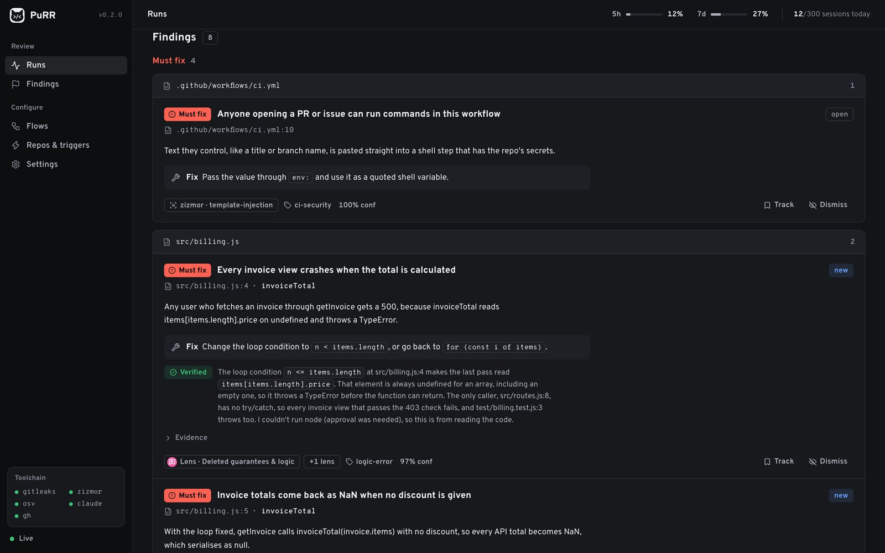
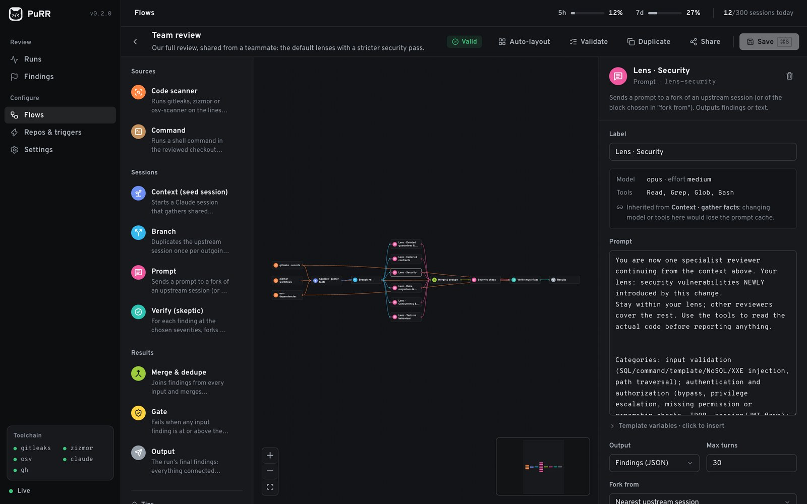

<p align="center">
  /<">
</p>

<h1 align="center">PuRR</h1>

<p align="center">
  <b>Pull Request Reviewer</b><br>
  A macOS menu-bar app that reviews every commit and push you make, with code scanners and a team of Claude Code reviewers.
</p>

<p align="center">
  
  
  
  
  <a href="LICENSE"></a>
</p>

<p align="center">
  <a href="#quick-start">Quick start</a> ·
  <a href="#covers-every-repo-while-its-running">How it hooks in</a> ·
  <a href="#how-a-review-works-default--full-review">How a review works</a> ·
  <a href="#flows-and-triggers">Flows</a> ·
  <a href="#sharing-flows">Sharing</a> ·
  <a href="#cli">CLI</a>
</p>

<p align="center">
  <picture>
    <source media="(prefers-color-scheme: dark)" srcset="docs/assets/hero-dark.png">
    
  </picture>
</p>

## Why PuRR

- **Every repo, automatically.** While PuRR runs, git's global hooks route every commit and push through it. Nothing to set up per repo, and quitting the app turns it off.
- **Blocks the obvious, reviews the subtle.** gitleaks, zizmor and osv-scanner stop secrets and risky changes at commit and push time. After a push to an open PR, a Claude review digs into logic, contracts, security, data and tests.
- **One context, many reviewers.** A seed session reads the change once, then forks into six specialist lenses that share its context through the prompt cache. Severity and skeptic-verify passes cut the noise.
- **Reviews you can design and share.** Flows are graphs you edit visually: scanners, sessions, branches, prompts, merges, gates. Assign a different flow to each trigger, globally or per repo, and share a flow as one line of text.
- **Your own account, nothing more.** PuRR drives the unmodified `claude` CLI headlessly, signed in with your own account. It never reads `~/.claude`, the keychain or OAuth tokens, and never calls the Anthropic API itself. All Claude access goes through `src/server/claude.ts`.

## Quick start

**Install the app:**

```bash
git clone https://github.com/ryj-dev/purr && cd purr
npm install && npm run dist           # builds release/PuRR-<version>-arm64.dmg
```

Open the `.dmg` and drag **PuRR** to Applications. (If you were given a `.dmg` instead of building it, macOS blocks the first launch because PuRR isn't notarised: allow it under System Settings → Privacy & Security → **Open Anyway**.) PuRR then runs in the menu bar, starts at login, and covers every repo. To use the command line too, choose **Install command line tool** from the menu-bar icon.

**Or run from source** (for development):

```bash
npm install && npm run build          # build the UI (the service runs from TypeScript, no build step)
./bin/purr daemon                     # http://127.0.0.1:7878
```

**Requirements:**
- Node ≥ 23.6 (developed on 26)
- git
- `claude`
- gitleaks, zizmor and osv-scanner: `brew install gitleaks zizmor osv-scanner`. A missing scanner shows as "not installed"; it doesn't fail the run.
- `gh`, optional: adds PR title/description and the open-PR poller.

## Covers every repo while it's running

PuRR isn't opt-in per repo. While the service runs (PuRR.app, or `purr daemon`):

- **Commit and push checks run in every repository.** On start, purr points git's global `core.hooksPath` at `~/.purr/hooks`. Those scripts first run whatever they displace: each repo's own `.git/hooks/<name>` (git-lfs and the like keep working) and the global hooks path you had before purr. Only `pre-commit` and `pre-push` then call purr.
- **Quitting PuRR turns the checks off.** The hooks call PuRR only while its service is running (a live `~/.purr/service.pid`); otherwise they just run your own hooks. `purr hooks uninstall --global` removes them and restores your previous `core.hooksPath`.
- **Repos register themselves** on their first commit or push through purr, so the PR poller, ledger and per-repo settings cover them. To leave a repo out, set its triggers to *Disabled* on the Triggers page.
- **Post-push reviews only for pushes to open PRs** (Settings → "Review only pushes to open PRs", on by default; needs `gh`). Pushes to `main` or to branches without a PR don't spend Claude quota; a branch is reviewed once its PR opens.
- **Exception:** repos that set their own `core.hooksPath` (husky) keep it, because git prefers the repo's setting, so their commit/push checks don't run. Their PRs are still reviewed after each push via the poller.

## How a review works (Default · Full review)

```
[gitleaks][zizmor][osv] ──► [Context · gather facts] ──► [Branch ×6] ──► 6 lenses ──► [Merge] ──► [Severity] ──► [Verify] ──► [Results]
          └──────────────────────────── scanner hits go straight to Results ─────────────────────────────────────────┘
```

1. **Scanners** run on the lines the change adds. This is ported from tc-ai-reviewer: gitleaks on a sparse copy of the added lines, zizmor at high severity, osv-scanner for new critical/high vulnerabilities compared with base.
2. **Context (seed session):** one Opus session gets the diff, the full changed files (line-numbered, within a 140k-char budget), CLAUDE.md as hints, and the scanner results. It gathers facts only: callers of changed code, guarantees removed by the diff, relevant tests.
3. **Branch** duplicates that session. Each **lens** forks it (`claude -p --resume <seed> --fork-session`) and reads the seed's context from the prompt cache. The six lenses are:
   - deleted guarantees and logic
   - callers and contracts
   - security, using tc-ai-reviewer's precedents
   - data, migrations and money
   - concurrency and failure
   - tests compared with behaviour
4. **Merge** de-duplicates conservatively: same place *and* similar wording.
5. **Severity** forks the *seed*, not a lens, so it sees the whole PR. It writes a failure scenario first, then labels the finding must_fix, consider, minor or drop.
6. **Verify** forks the seed once per must-fix, with instructions to try to refute it. Refuted findings are dropped. An unreadable verdict downgrades the finding to "consider" (fails closed).
7. **Results** go through the **ledger**, keyed by a fingerprint of category + file + symbol + normalised code window:
   - a finding is **new** the first time it's raised
   - **open** when it's raised again
   - **regression** if it comes back after being fixed
   - **dismissed** or **tracked** findings are shown but don't count, and gates ignore them

**Cache rule, measured:** a fork only reads the seed from cache if it re-sends the seed's `--model`, `--effort` and `--tools`. PuRR does this automatically ("inherited" in the editor). Only `--allowedTools` can differ per fork. On the smoke test, forks read about 46k tokens from cache and wrote about 6k.

## Flows and triggers

- **Flows page:** three read-only defaults:
  - **Pre-commit scan:** gitleaks, then a gate.
  - **Pre-push scan:** all three scanners, then a gate.
  - **Full review:** as described above.

  To change one, **Duplicate** it, then edit, delete or create new flows.
- **Editor:** a palette of 9 block types. Drag to connect blocks. The inspector edits prompts, models, tools and limits. Validation runs live and checks for:
  - cycles
  - blocks that need a session but have none
  - a "fork from" block that must come earlier in the flow
  - branch misuse
  - allowed tools that aren't in the inherited tool set

  Template variables (`{{diff}}`, `{{scanner_findings}}`, `{{findings}}`, …) can be inserted from the prompt field.
- **Triggers page:** sets a flow per trigger, globally, with per-repo overrides ("Inherit global" or "Disabled").
- **Post-push detection:** git has no post-push hook, so PuRR uses two sources:
  - The global pre-push hook tells the daemon what is being pushed. The daemon confirms the remote moved (`git ls-remote`), debounces (60s by default), and supersedes older runs on the same branch.
  - A `gh` poller over your open PRs catches pushes made from elsewhere.
- **Background reviews** run in a detached worktree per run (`~/.purr/worktrees/<repo>/<run>`, newest 10 kept), so your checkout is never touched and concurrent runs never share one. The run page's "Copy resume" gives `cd <worktree> && claude --resume <id>`, because Claude Code stores sessions per working directory.
- **Pre-push base:** a fast-forward push scans exactly the commits being sent. A new branch, or a force-push after a rebase, scans only the branch's own commits (merge-base with the default branch), never the teammates' commits a rebase pulled in.

## Sharing flows

A flow travels as one line of text, so it fits in a chat message, an issue or a gist:

```
purr-flow:v1:7Vztctw2ln0VpKsmkabYLckf2Wxrd6ocWU6c8kfWkidJRSkXmkR3I2KTPQSp…
```

- **Export:** the **Share** button on a flow (Flows page or editor) shows the text, with a Copy button. It holds the flow's blocks, prompts and settings, and nothing about your repos, runs or findings. You can also switch to the readable JSON.
- **Import:** **Flows → Import**, paste, then read the preview before importing.

<p align="center"></p>

An imported flow is untrusted until you've read it:

- **Rebuilt from known parts only:** every block is rebuilt from PuRR's own block types and settings, and anything else is dropped. The preview lists anything that was dropped or repaired.
- **What it can do is spelled out:** command blocks run any shell command in your repo, and Claude sessions can carry tool permissions such as Bash, file edits or web access. The preview lists each one with the exact command or permission, and Import stays disabled until you confirm you've read them.
- **Nothing runs it yet:** it's saved as a new, editable flow and isn't assigned to any trigger until you choose one on **Repos & triggers**.

From a terminal: `purr flow export <id>` prints the text (`--json` for the JSON), and `purr flow import [file]` reads it from a file or stdin, listing the same risks and asking for `--yes` when there are any.

## Screenshots

<table>
  <tr>
    <td></td>
    <td></td>
  </tr>
  <tr>
    <td align="center">Findings read like review comments, each verified by a skeptic pass</td>
    <td align="center">The flow editor: blocks, connections and each block's prompt</td>
  </tr>
</table>

## Never blocks you by accident

- Only a **gate** block can fail a commit or push. The hook script turns every other exit into 0: a purr crash, a missing node after an upgrade, a deleted checkout.
- Timeouts and cancels kill the whole process group, so a hung `npm test` in a command block can't hang a hook.
- `PURR_SKIP=1 git commit …` skips purr once.
- A dismissed finding stops blocking.
- Your own hooks always run first, and quitting PuRR leaves only them.

## Quota guardrails

- **Max concurrent Claude sessions:** 4 by default.
- **Daily session cap:** 300 by default.
- **Usage meters:** the 5-hour and 7-day meters come from the `rate_limit_event` Claude Code prints after each session.
- **Rate limits:** when a limit is hit, Claude work pauses until the reset time and queued runs wait. Scanner-only flows keep running.

## CLI

```
purr daemon | open | run [--repo P] [--flow ID] [--base REF] [--head REF] [--json]
purr repo add [PATH] | hooks install|uninstall | agent install|uninstall
purr flow list | export <id> [--json] | import [file|-] [--yes]
```

`purr run` exits with 0 when the review is clean, 1 when there's a must-fix, and 2 when the run failed.

## Layout

| Path | What |
|---|---|
| `src/server/claude.ts` | the only code that launches `claude`; quota, rate-limit parsing, semaphore |
| `src/server/engine/` | flow executor, findings (normalise / dedupe / fingerprint), PR material |
| `src/server/flows/` | block types, default flows and prompts, validation, CRUD |
| `src/server/scanners.ts` | gitleaks / zizmor / osv (port of tc-ai-reviewer's `scanners.py`) |
| `src/server/manager.ts` | runs: prepare change + worktree, execute, ledger, notifications, supersede, debounce, pause |
| `src/server/triggers.ts` | post-push: push-intent confirmation + gh poller |
| `src/server/http.ts` | REST + SSE API ([docs/API.md](docs/API.md)) and the static UI |
| `src/server/hooks.ts` | hook install/uninstall with chaining |
| `web/` | React + React Flow UI |
| `test/` | `npm test` runs unit + integration tests (a fake `claude`, real gitleaks, a real `git push` to a bare remote) |

Data lives in `~/.purr/` (`purr.db`, `worktrees/`, `logs/`), or in `$PURR_HOME` if set.

## Known gaps (next steps)

- No fix⇄review convergence loop yet. Verify plus severity are the only second passes.
- No summary-writer block. Notifications and PR comments use a deterministic summary.
- No incremental re-review. Each push reviews the whole branch range; the ledger keeps repeats quiet.
- De-duplication across lenses is deterministic and conservative; the severity step is asked to drop duplicates. Opus does this well. On Haiku, near-duplicates (the same issue worded three ways) can survive. An LLM same-issue block, like tc-ai-reviewer's `same_issue.md`, is the next thing to add.
- The pre-push gate scans every commit being pushed, so a secret added and later removed in the same push still blocks it. That matches gitleaks' history semantics.
- The UI loads as a single 700 kB bundle and the editor has no undo/redo.
- Posting PR comments is off by default (`Output` block → "Post PR comment").

## Licence

[MIT](LICENSE) © 2026 Ry Jenkins
